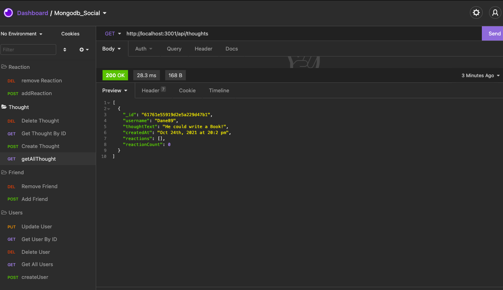

# Mongodb_Social
# EmployeeDatabase
  
  ## Description
  The Code Repository("Mongodb_Socal) intent is to have a Social Network backend that allows you to add your thoughts, and reactions to thoughts. The code also includes a User methodology that will tie a User to thoughts and reactions. In this repo/project Mongodb was used with Mongoose, and the use of express npm was also utilized for this project. For this project API GET routes were implemented for thought, user and reactions. There are also API POST, PUT and DELETE Routes for deleting and updating the user, and thoughts. The project also has the funtionality to test API POST and DELETE VIA Insomnia for Reactions. 

  ## Table of Contents 
  [Installations](#Installations)
  
  [Usage](#Usage)
  
  [Contributors](#Contributors)
  
  [License](#License)
  
  [Tests](#Tests)
  
  [Questions](#Questions)
  
  
  ## Installations
  For this project you will need Mongodb installed on your computer, and you will also need to ensure that you install version 5.3.15 of Mongoose, as well as expresss. 

   ## Usage
 The project could be used for a MVP of a Social media site or a daily thought collector for your thoughts with the idea that you could add your own reactions, and your friends could also read your reactions as well. This could be really easy to be turned into a blog. 

  # Demonstration
  [The video can be viewed through clicking on this link:](https://www.awesomescreenshot.com/video/5753025?key=91fc35fab162bf62b281009688de8435)

    
   ## Contribution
  There were no contributions from Students, but I did utilize the TA's during Office Hours
  ## Tests
The project can be tested via Insomnia by testing the API routes. 
  ## Questions
  For any questions, please reach out to me at: 
  Github: [Kamm8899](https://github.com/kamm8899/README-Generator)  
  Email: [kamm8899@gmail.com](mailto:kamm8899@gmail.com)
  # License 
  This repo is using: [ISC](https://opensource.org/licenses/ISC)

